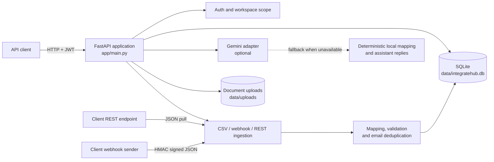

# IntegrateHub

> A focused control plane for onboarding client data into clean, usable records.

IntegrateHub is a small, self-contained data integration API built for client onboarding and integration operations. It accepts CSV files, signed webhooks, and REST sources; normalizes incoming records; flags duplicate emails; and stores client documents for API consumers.

The AI layer is deliberately optional. When `GEMINI_API_KEY` is configured, Gemini suggests field mappings and answers questions about workspace facts. When it is absent or unavailable, IntegrateHub uses deterministic local behavior so the application remains runnable without a model provider.

## Highlights

- **One workspace for onboarding:** authentication, connectors, records, documents, and app connections share one client-scoped view.
- **Multiple ingestion paths:** upload CSV files, receive HMAC-SHA256 signed webhooks, or pull JSON from a REST endpoint.
- **Practical data hygiene:** records are stored with source and status metadata, and duplicate emails are flagged instead of silently discarded.
- **AI-assisted mapping:** Gemini can map source fields to `first_name`, `last_name`, `email`, `company`, `phone`, and `role`, with a local alias-based fallback.
- **Grounded assistant:** the assistant answers from live workspace counts rather than inventing connector or record state.
- **Local-first storage:** SQLite and a mounted uploads directory keep the project easy to run locally and with Docker.
- **Inspectable API:** FastAPI publishes interactive OpenAPI documentation at `/docs`.

## Table of contents

- [Architecture](#architecture)
- [How it works](#how-it-works)
- [Quick start](#quick-start)
- [Docker](#docker)
- [Configuration](#configuration)
- [API surface](#api-surface)
- [Project layout](#project-layout)
- [Security and data handling](#security-and-data-handling)
- [Development checks](#development-checks)
- [Known limitations](#known-limitations)

## Architecture

IntegrateHub is a single FastAPI process serving a JSON API. SQLite is created at startup at `data/integratehub.db`; uploaded files are written to `data/uploads/`. Gemini and external REST sources are optional outbound dependencies.



The editable diagram is also available in [docs/architecture.md](docs/architecture.md).

## How it works

### 1. Create a workspace

Register with a name, email, and password, or use an existing account. The API returns a 12-hour JWT. Every authenticated query includes the user scope in its SQLite lookup.

### 2. Configure a source

Connectors support three kinds:

| Kind      | Input                                      | Configuration                                                    |
| --------- | ------------------------------------------ | ---------------------------------------------------------------- |
| `csv`     | `POST /api/ingest/csv`                     | Created automatically on first CSV upload, or created explicitly |
| `webhook` | `POST /api/webhooks/{connector_id}`        | Requires an encrypted signing secret and `X-Webhook-Signature`   |
| `rest`    | `POST /api/connectors/{connector_id}/sync` | Requires an endpoint URL and optionally a bearer token           |

### 3. Normalize and review

CSV and JSON rows are stored as JSON with their source, connector, status, external ID, and creation time. Email is the primary deduplication key. The `GET /api/dashboard` endpoint exposes record totals, duplicate counts, connector health, recent ingestion logs, and the latest 100 records.

### 4. Add context and destinations

Documents such as payload examples or client briefs can be uploaded and downloaded from the workspace. The seeded app catalog includes Slack, HubSpot, Google Sheets, and a generic REST connection; these catalog entries track connection status but do not yet push records to those services.

## Quick start

### Requirements

- Python 3.12 or newer
- PowerShell on Windows, or a shell with equivalent virtual-environment commands
- Optional: a Gemini API key from [Google AI Studio](https://aistudio.google.com/apikey)

### Run locally

```powershell
git clone <your-fork-url>
cd IntegrateHub
python -m venv .venv
.\.venv\Scripts\Activate.ps1
pip install -r requirements.txt
Copy-Item .env.example .env
uvicorn app.main:app --reload
```

Use an API client against `http://127.0.0.1:8000`. Register with `POST /api/auth/register`, then use the returned JWT for authenticated requests. The sample file at [data/sample_contacts.csv](data/sample_contacts.csv) can be imported with `POST /api/ingest/csv`.

On macOS or Linux, use `source .venv/bin/activate` and `cp .env.example .env` in place of the PowerShell commands.

## Docker

The compose setup keeps SQLite and uploaded files on the host through `./data:/app/data`.

```powershell
Copy-Item .env.example .env
docker compose up --build
```

Open [http://127.0.0.1:8000](http://127.0.0.1:8000) after the container starts. Stop it with `Ctrl+C`; use `docker compose down` to remove the container while retaining the host data directory.

The image runs Uvicorn as the unprivileged `integratehub` user. Docker and Compose expose the same `/health` probe, and Compose restarts the service after an unexpected exit. The `.dockerignore` file excludes local secrets, databases, virtual environments, and uploaded documents from the build context.

## Configuration

Copy `.env.example` to `.env` before starting the server:

| Variable                                      | Default                      | Purpose                                                                                                                |
| --------------------------------------------- | ---------------------------- | ---------------------------------------------------------------------------------------------------------------------- |
| `JWT_SECRET`                                  | `dev-only-change-me` in code | Signs login tokens and derives the Fernet key used for connector secrets. Set a long random value outside local demos. |
| `GEMINI_API_KEY`                              | empty                        | Enables Gemini mapping suggestions and assistant responses. Empty means local fallback behavior.                       |
| `GEMINI_MODEL`                                | `gemini-2.0-flash`           | Gemini model name used by the optional AI layer.                                                                       |
| `OAUTH_BASE_URL`                              | `http://127.0.0.1:8000`      | Public base URL used to build OAuth callback URLs. Use your HTTPS deployment URL outside local development.            |
| `GOOGLE_CLIENT_ID` / `GOOGLE_CLIENT_SECRET`   | empty                        | Google OAuth credentials for Google Sheets sign-in.                                                                    |
| `SLACK_CLIENT_ID` / `SLACK_CLIENT_SECRET`     | empty                        | Slack OAuth credentials for Slack sign-in.                                                                             |
| `HUBSPOT_CLIENT_ID` / `HUBSPOT_CLIENT_SECRET` | empty                        | HubSpot OAuth credentials for HubSpot sign-in.                                                                         |

Never commit `.env`, database files, or uploaded documents. They are ignored by the repository's `.gitignore`.

### Enable real app sign-in

Create OAuth applications in the Google Cloud Console, Slack API dashboard, and HubSpot developer portal. Register these callback URLs exactly, replacing the host with your deployment URL when applicable:

```text
http://127.0.0.1:8000/api/integrations/oauth/google/callback
http://127.0.0.1:8000/api/integrations/oauth/slack/callback
http://127.0.0.1:8000/api/integrations/oauth/hubspot/callback
```

Copy each client ID and secret into `.env`, restart the server, and use **App connections** in the workspace. Google Sheets, Slack, and HubSpot will open their own consent screens; successful callbacks store encrypted access and refresh tokens per workspace. The REST API card remains an endpoint-and-token connector because it has no single OAuth authority.

## API surface

Authentication uses `Authorization: Bearer <token>` except for webhook ingestion, which is authenticated by its HMAC signature.

| Area            | Routes                                                                                          |
| --------------- | ----------------------------------------------------------------------------------------------- |
| Health          | `GET /health`                                                                                   |
| Auth            | `POST /api/auth/register`, `POST /api/auth/login`                                               |
| Workspace       | `GET /api/dashboard`                                                                            |
| Connectors      | `GET/POST /api/connectors`, `GET /api/connectors/{id}/health`, `POST /api/connectors/{id}/sync` |
| Ingestion       | `POST /api/ingest/csv`, `POST /api/webhooks/{connector_id}`                                     |
| AI              | `POST /api/connectors/suggest-mapping`, `POST /api/clients/assistant/chat`                      |
| Records         | `GET /api/records`                                                                              |
| Documents       | `GET/POST /api/documents`, `GET /api/documents/{id}/download`                                   |
| App connections | `GET /api/integrations`, `POST /api/integrations/{id}`                                          |

### Signed webhook example

The signature is the SHA-256 HMAC of the canonical JSON body, using the connector secret:

```python
import hashlib
import hmac
import json

body = {"email": "taylor.stone@example.com", "company": "Northstar Labs"}
raw = json.dumps(body, separators=(",", ":"), sort_keys=True).encode()
signature = hmac.new(b"your-webhook-secret", raw, hashlib.sha256).hexdigest()
print(signature)
```

Send that value as `X-Webhook-Signature: sha256=<signature>`.

## Project layout

```text
IntegrateHub/
├── app/
│   ├── main.py                 FastAPI routes, auth, ingestion, persistence, AI fallback
│   └── __init__.py
├── data/
│   ├── sample_contacts.csv     Importable sample data
│   └── uploads/                Runtime document storage
├── docs/
│   └── architecture.md         Standalone architecture diagram and notes
├── Dockerfile
├── docker-compose.yml
├── requirements.txt
└── .env.example
```

## Security and data handling

- Passwords are stored as salted PBKDF2-HMAC-SHA256 hashes.
- JWTs expire after 12 hours and are required for workspace-owned endpoints.
- Connector secrets are encrypted at rest when `cryptography` is available; the API never returns the encrypted value.
- Webhooks use constant-time HMAC comparison.
- User IDs are included in database queries to prevent cross-workspace reads and downloads.
- Uploaded filenames are reduced to their final path component and prefixed with an internal identifier.
- The container process runs without root privileges; runtime state is kept in the mounted `data/` directory.

This is a small local or internal tool, not a hardened multi-tenant SaaS boundary. Use HTTPS, a strong `JWT_SECRET`, a managed database, and an external object store before exposing it to untrusted users.

## Development checks

There is currently no automated test suite in the repository. Use these smoke checks after changes:

```powershell
python -m compileall app
python -c "from fastapi.testclient import TestClient; from app.main import app; print(TestClient(app).get('/health').json())"
```

The second command should print `{'status': 'ok', 'database': 'connected'}` and may create the local SQLite database under `data/`.

## Known limitations

- SQLite is appropriate for local and small internal use, but there are no migrations, pooling, or multi-instance coordination.
- The app catalog records connection state; Slack, HubSpot, and Google Sheets delivery is not implemented yet.
- CSV ingestion parses UTF-8 CSV and performs email-based duplicate detection, but does not provide a full schema validation report.
- Gemini requests are made synchronously inside API handlers and fall back on provider errors.
- API clients must store JWTs securely; production deployments should consider an HttpOnly cookie flow for browser clients.
- The default CORS policy allows all origins and should be restricted for a public deployment.

## License

No license has been declared yet. Add a license before redistributing the project.
