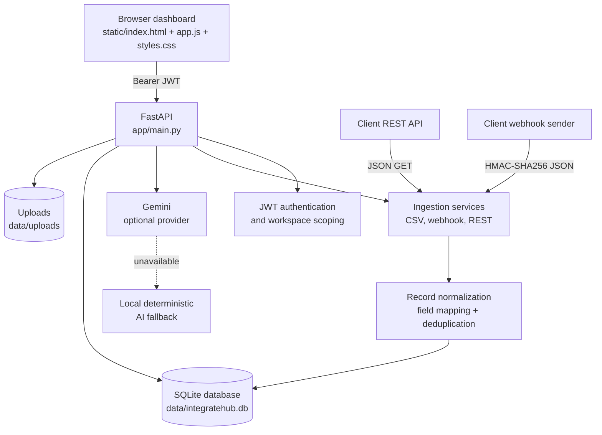

# IntegrateHub architecture

This diagram describes the runtime path for the local and Docker deployments. The browser talks to one FastAPI process, which owns authentication, ingestion, AI calls, and persistence.

## Responsibilities

| Component | Responsibility |
| --- | --- |
| Browser dashboard | Authentication forms, workspace navigation, uploads, connector actions, and record display. |
| FastAPI application | Route handling, token verification, workspace ownership checks, connector orchestration, and static-file serving. |
| Ingestion services | Read CSV data, verify webhook signatures, fetch REST JSON, and write ingestion logs. |
| Normalization | Apply connector mappings, assign source metadata, and mark duplicate records. |
| SQLite | Store users, connectors, records, documents, integrations, and ingestion logs. |
| Upload storage | Keep document bytes outside SQLite while storing metadata and ownership in the database. |
| Gemini and fallback | Provide mapping suggestions and grounded assistant replies, with local behavior when Gemini is not configured. |