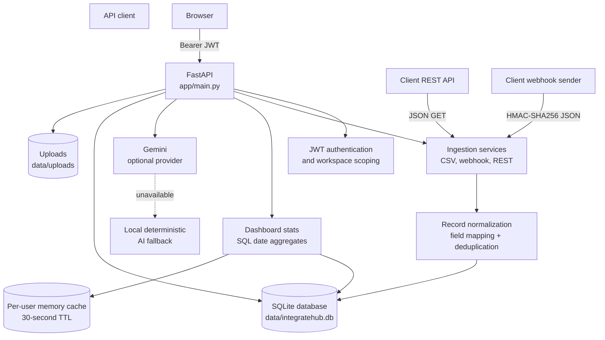

# IntegrateHub architecture

This diagram describes the runtime path for the local and Docker deployments. The browser talks to one FastAPI process, which owns authentication, ingestion, AI calls, and persistence.

```mermaid
flowchart TB
    Client[API client]
    API[FastAPI\napp/main.py]
    Auth[JWT authentication\nand workspace scoping]
    Ingest[Ingestion services\nCSV, webhook, REST]
    Stats[Dashboard stats\nSQL date aggregates]
    StatsCache[(Per-user memory cache\n30-second TTL)]
    Normalize[Record normalization\nfield mapping + deduplication]
    AI[Gemini\noptional provider]
    Fallback[Local deterministic\nAI fallback]
    SQLite[(SQLite database\ndata/integratehub.db)]
    Uploads[(Uploads\ndata/uploads)]
    RestSource[Client REST API]
    WebhookSource[Client webhook sender]

    Browser -->|Bearer JWT| API
    API --> Auth
    API --> Ingest
    API --> Stats
    Stats --> SQLite
    Stats --> StatsCache
    API --> AI
    AI -. unavailable .-> Fallback
    Ingest --> Normalize
    Normalize --> SQLite
    API --> SQLite
    API --> Uploads
    RestSource -->|JSON GET| Ingest
    WebhookSource -->|HMAC-SHA256 JSON| Ingest
```

## Responsibilities

| Component           | Responsibility                                                                                                                                             |
| ------------------- | ---------------------------------------------------------------------------------------------------------------------------------------------------------- |
| Browser dashboard   | Split-screen authentication, workspace navigation, uploads/downloads/deletion, connector actions, record comments, search, saved views, and stats fetches. |
| FastAPI application | Route handling, token verification, workspace ownership checks, connector orchestration, and dashboard stats.                                              |
| Ingestion services  | Read CSV data, verify webhook signatures, fetch REST JSON, and write ingestion logs.                                                                       |
| Normalization       | Apply connector mappings, assign source metadata, and mark duplicate records.                                                                              |
| SQLite              | Store users, connectors, records, comments, saved views, documents, integrations, audit events, and ingestion logs.                                        |
| Upload storage      | Keep document bytes outside SQLite while storing metadata and ownership in the database.                                                                   |
| Gemini and fallback | Provide mapping suggestions and grounded assistant replies, with local behavior when Gemini is not configured.                                             |
| Dashboard stats     | Aggregate records and duplicates by `date(created_at)` in SQL; aggregate source totals and connector ingestion-log events per user.                        |
| Stats cache         | Cache each user's dashboard stats response in process memory for 30 seconds; no Redis dependency is used.                                                  |

## CRM v1

Record comments belong to a record and retain the author and creation time. Workspace access is checked through the parent record before comments are read or added; comment creation also writes an event to `audit_log`. `saved_views` stores each user's named filter set within the active workspace. The Records UI applies source, status, date-range, and keyword filters to the most recent 100 records returned by `/api/records`.

`/api/search` searches record data, comment text, document names, and the first 128 KB of common UTF-8 text documents. `/api/activity` combines record creation timestamps, connector ingestion logs, comments, and existing audit events into one reverse-chronological workspace feed. No separate activity log or search service is introduced.

## Dashboard statistics

`GET /api/stats/dashboard` is user-scoped by `user_id` and returns four arrays: `records_by_day` (14 UTC dates), `records_by_source` (the same 14-day period), `duplicates_by_day` (7 UTC dates using the existing `duplicate` status), and `sync_volume_by_connector` (each connector's current `records` total plus a recent activity value). Daily series are grouped by SQLite `date(created_at)` and zero-filled after aggregation. For a connector with ingestion log entries in the last 7 UTC dates, `last_7_days` is the number of those log entries; otherwise it falls back to the connector's current record total. The `basis` field identifies which value was used.

The response is cached per user in a single-process dictionary for 30 seconds. The browser fetches the endpoint once per dashboard load and retains the response in `state.dashboardStats`; failed or empty series get zero-valued fallbacks. The current dashboard does not define chart containers or `lineChart`/`barChart` renderers, so chart visualization is not implemented yet. The existing KPI tiles and page layout remain unchanged.

The browser font stack requests SF Pro first, then platform system fonts, Segoe UI, and generic sans-serif. SF Pro is available on Apple platforms but may fall back on Windows systems without that font installed.

The sign-in/register view is split-screen with inline field errors, a registration password hint, and a Google sign-in placeholder. Existing login/register API inputs and outputs remain unchanged. V2 messaging, notifications, and kanban features are not part of this implementation.
